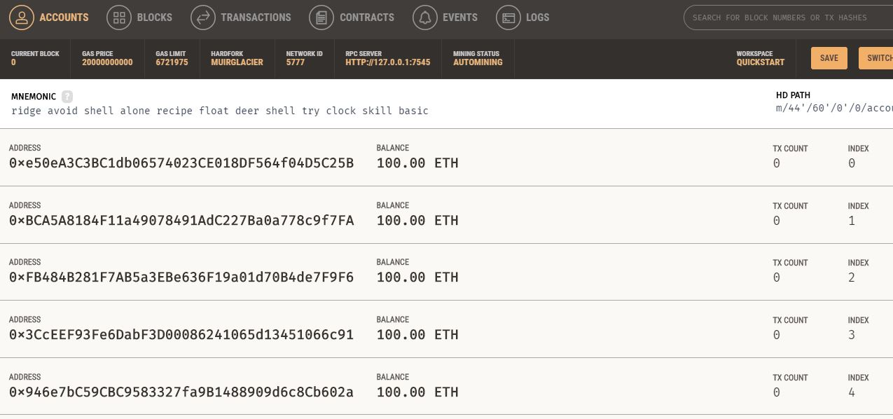
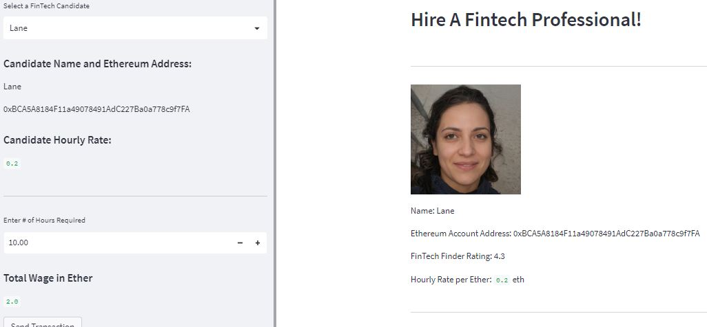
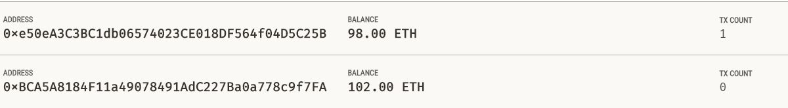
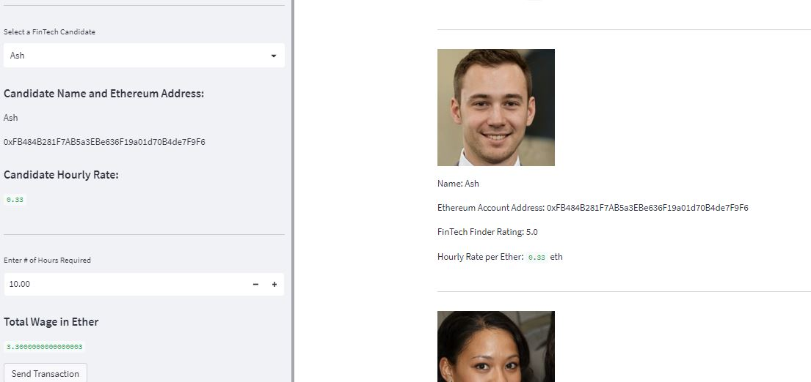
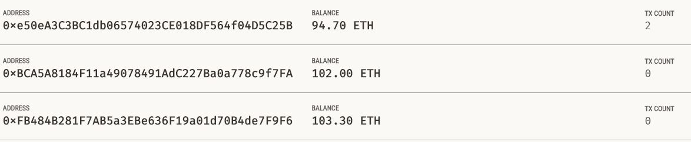
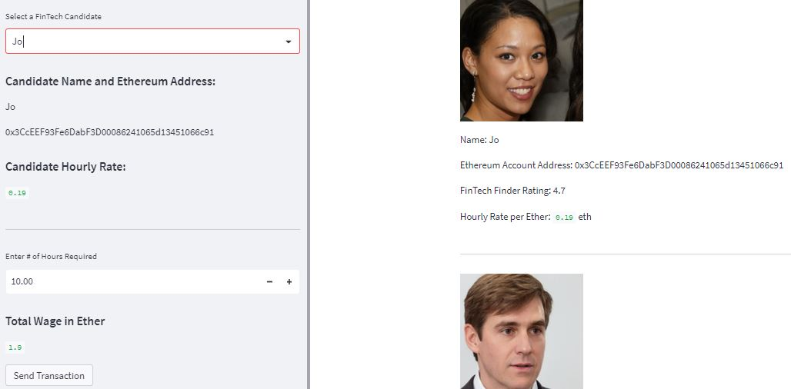
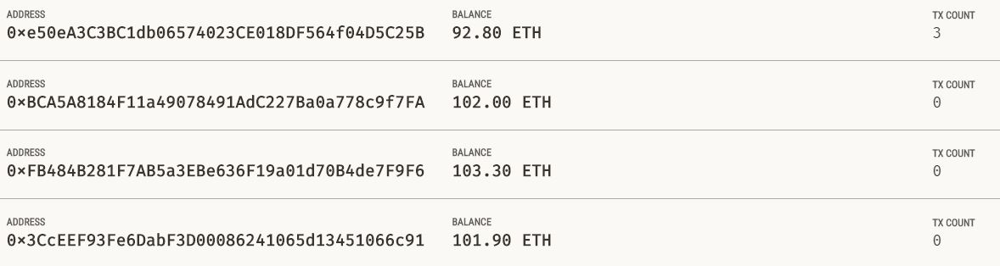
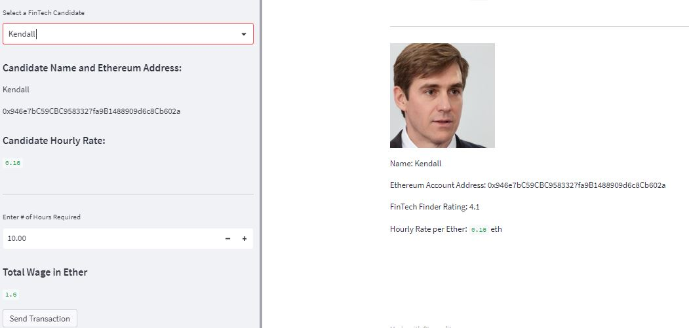
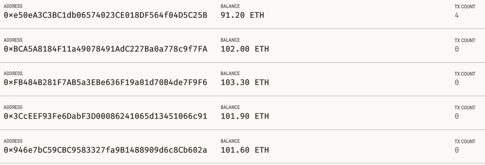
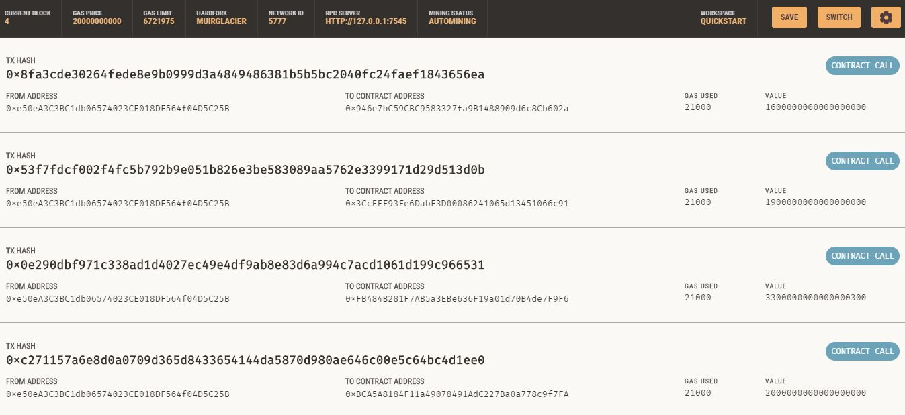

# Columbia Fintech Bootcamp: Module #19 Challenge

---

Feature Summary: Fintech Finder / Cryptocurrency Wallet

Fintech Finder is an application that customers from a startup company can use to find fintech professionals from among a list of candidates, hire them, and pay them. Tasked with integrating the Ethereum blockchain network into the application in order to enable the customers to instantly pay the fintech professionals whom they hire with cryptocurrency.

- Includes the following tasks:

    - Generate a new Ethereum account instance by using the mnemonic seed phrase provided by Ganache.
    - Fetch and display the account balance associated with an Ethereum account address.
    - Calculate the total value of an Ethereum transaction, including the gas estimate.
    - Digitally sign a transaction that pays a Fintech Finder candidate.
    - Send this transaction to the Ganache blockchain.

---

## Technologies

This project leverages python 3.9 with the following packages:
- [streamlit](https://streamlit.io/) - Streamlit turns data scripts into shareable web apps.
- [web3](https://pypi.org/project/web3/) - A Python library for interacting with Ethereum.
- [bip44](https://pypi.org/project/bip44/) - Simple Python bip44 implementation. Mnemonic + bip32.
- [dotenv](https://pypi.org/project/python-dotenv/) - reads key-value pairs from a .env file and can set them as environment variables.
- [dataclasses](https://docs.python.org/3/library/dataclasses.html) - Provides a decorator and functions for automatically adding generated special methods.
- [typing](https://docs.python.org/3/library/typing.html) - Provides runtime support for type hints.
- [requests](https://pypi.org/project/requests/) - Requests is a simple HTTP library..
- [os](https://docs.python.org/3/library/os.html) - Miscellaneous operating system interfaces.

Jupyter Lab 3.3.2 is required

- *Jupyter Lab is primarily used as a web-based development environment for the notebooks, code, and data associated with this project.  Its flexible interface allows users to configure and arrange workflows in data science*

---

## Installation Guide

Before running the application first install the following dependencies.

```python
  pip install streamlit
  pip install dataclasses
  pip install typing
  pip install datetime
  pip install os
  pip install web3
  pip install dotenv
  pip install bip44

```

*Assumption made for module challenge: the* **sys** *and Path module will not be required to be explicitely called out in Installation guide section*

To run Jupyter Lab, need to install:
- [Anaconda](https://docs.anaconda.com/anaconda/install/) - an open-source distribution of the Python
- [Ganache](https://trufflesuite.com/ganache/) - personal Ethereum blockchain which you can use to run tests
---

## Usage

To run the Machine Learning Trading Bot application, simply clone the repository and run the **streamlit fintech_finder.py** script in Jupyter Lab:

---
## Analysis
---

### Initial State of Accounts in Ganache
                

---
---

### Transaction #1 (Hire Lane for 2 ether)
    
### Updated Account Status in Ganache
      

---
---

### Transaction #2 (Hire Ash for 3.3 ether)
    
### Updated Account Status in Ganache
      

---
---

### Transaction #3 (Hire Jo for 1.9 ether)
    
### Updated Account Status in Ganache
      

---
---

### Transaction #1 (Hire Kendall for 1.6 ether)
    
### Updated Account Status in Ganache
      

---

### Final State of Accounts in Ganache
                

---
---

## Contributors

Contributors:
- Stratis Gavnoudias
---

## License

GNU GENERAL PUBLIC LICENSE Version 3, 29 June 2007
